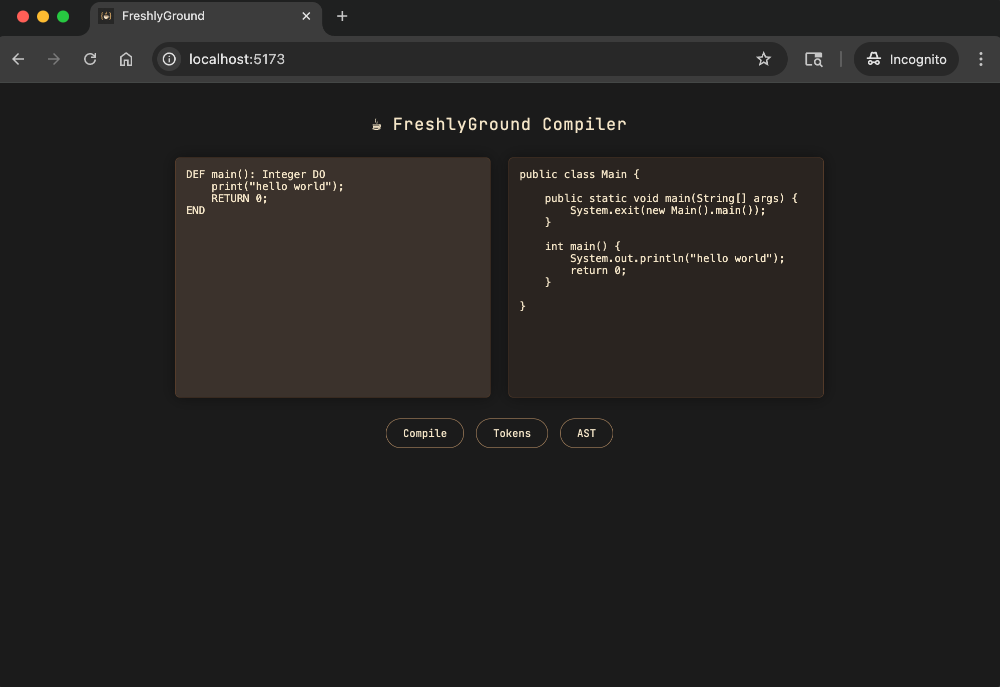

<!-- PROJECT LOGO -->
<br />
<div align="center">
  <a href="https://github.com/<your_repo>">
    
  </a>

  <h3>
    A Java based novel programming language
  </h3>
</div>

---
<!-- ABOUT THE PROJECT -->
## About The Project
FreshlyGround is a **novel programming language and compiler** designed around a clean, multi-pass architecture 
that separates syntax, semantics, and code generation into explicit, single-responsibility components. It can be
run via a web UI or command line compiler (see, Quick Start).

The project originated as an academic transpiler for **COP 4020** at the **University of Florida**. It has since been 
refactored into a full compiler toolchain, and web environment. Its design is strongly influenced by the `lox` 
programming language in [*Crafting Interpreters*](https://www.craftinginterpreters.com/), with an emphasis on explicit intermediate representations, 
externalized semantic bindings, and multiple pluggable backends.

FreshlyGround currently targets the JVM and is being extended by means of a WebAssembly backend, with a 
browser-based execution environment, and a Hack VM backend for compilation to the nand2tetris CPU.

<br>
<p align="center">
  
  <br>
  <em>FreshlyGround Web Compiler User Interface</em>
</p>

### Requirements
Core:
- Java 21+
- Gradle (via included wrapper)

Web UI:
- Node.js 18+
- npm
- Vite v7.3.1

### Quick Start
1. Ensure you meed the given requirements
2. Clone this repository
3. Navigate to root (all following instructions assumed to be run from root, unless otherwise instructed)

### Run API Server
1. Start the server:
> ```bash
> ./gradlew runServer
> ```

2. Run a health check:
>```bash
> curl http://localhost:7070/health
> $ ok
>```

3. Send some source code:
>```bash
> curl -s -X POST http://localhost:7070/compile \
> -H "Content-Type: application/json" \
> -d '{"source": "DEF main(): Integer DO print(\"hello world\"); RETURN 0; END"}'
>```

### Run Web UI
1. Start the API Server, see above
2. Navigate to `root/web`
3. Start the app:
>```bash
> npm run dev
>```

4. Open your browser to [http://localhost:5173/](http://localhost:5173/)

### Compile and Run from the CLI
1. Place your code in `/examples/src`
   - Note: There is an existing sample file there to transpile (`hello.fg`)
2. Transpile with the following:
> ```bash
> ./gradlew build
> ./build/install/FreshlyGround/bin/fgc examples/src/<src_name>.fg examples/dist/Main.java
> javac examples/dist/Main.java
> ```

3. Run with the following:
> ```bash
> cd examples/dist
> java Main
> ```

### Run Tests
1. Finish the 'Quick Start' steps
2. Run the tests:
> ```bash
> ./gradlew test
> ```
3. Open report:
>```bash
> open build/reports/tests/test/index.html
>```

### Repository Structure
```text
./
 ├─ assets/            # Repo/docs Images
 ├─ api/               # REST adapter (POST /compile, file.fg → file.wat)
 ├─ docs/              # Technical reference and language specifications
 ├─ examples/          # Example programs
 ├─ gradle/            # Gradle wrapper
 ├─ src/
 │  ├─ main/           # Core compiler passes (cli (fgc), lexer, parser, analyzer, generator(s))
 │  └─ test/           # Generated outputs
 ├─ tests/             # Unit, interaction, and end-to-end tests
 ├─ web/               # Web UI
 └─ build.gradle
```

### Roadmap
#### Core Implementation

- [x] Complete COP 4020 baseline implementation
- [x] Enforce Java 21 via Gradle toolchain
- [x] Redesign and refactor compiler architecture
    - [x] Centralize error handling via `CompilerException`
    - [x] Enforce semantic / syntactic seporation of concerns
        - [x] Enforce syntactic validation within AST construction
        - [x] Remove syntactic validation logic from `Analyzer`
        - [x] Implement semantic `Bindings` layer
        - [x] Eliminate semantic state from AST nodes
        - [x] Remove semantic validation logic from `Parser`
    - [x] Remap Scope chain
        - [x] Move `String` under `Any`
        - [x] Change `Compariable` to `Primitive`
        - [x] Update comparable expression semantic rules
        - [x] Update `Analyzer`
    - [x] Introduce `Builtins` for member functions and variables
        - [x] Move current member functions and variables into `StandardLibrary`
        - [x] Restrict `Builtins` file to in scope declarations only
        - [x] Use generator or host ABI to implement functionality
    - [x] Remove JVM-specific concerns from `Environment` and member functions and variables
        - [x] Map builtin symbols to target representation (e.g., `jvmName`) in current generator
        - [x] Remove all references to `jvmName` in `Environment` and `Builtins`
    - [x] Ensure consistency with `nullable` values
        - [x] Update For loop `initialization` and `increment` to `Optional<Ast.Statement.Assignment>`
        - [x] Update Scope `parent` to `Optional<Scope>`
        - [x] Update parsing, generating, and testing to match

#### Compiler Architecture

- [x] Establish compiler-oriented architecture
    - [x] Enforce single-responsibility across all compiler layers

#### Command-Line Interface

- [x] Implement unified CLI entrypoint (`CompilerMain`)
- [x] Configure Gradle installation target as `fgc` (FreshlyGround Compiler)

#### Testing Improvements

- [ ] Refactor and expand test suite
    - [x] Split existing tests by intermediate representation class
    - [ ] Ensure unit tests validate only class-level responsibilities
    - [x] Reclassify current end-to-end tests as interaction tests
      - [x] Standardize integration tests with the use of a wrapper
    - [ ] Introduce CLI-driven end-to-end tests

#### Compiler Backends

- [ ] Add WebAssembly backend
    - [ ] Generate WAT (WebAssembly Text) from AST + Bindings
    - [ ] Define minimal host ABI for runtime interaction (e.g., `print_i32`)

#### Web Execution Environment

- [x] Build containerized web execution platform
    - [x] Develop lightweight web IDE frontend
    - [x] Implement minimal API service
- [x] Refactor `CompilerMain` into reusable entrypoint
    - [x] CLI becomes thin wrapper over shared entrypoint
    - [x] API becomes thin wrapper over shared entrypoint
- [ ] Implement `/compile` API endpoint
    - [x] POST source code → return Java output
    - [ ] Change POST from Java to WAT

#### Documentation

- [ ] Update README
- [ ] Expand and finalize `/docs` documentation set
    - [x] Cross-link all documentation sections
    - [x] Layout documents by compiler layer
    - [ ] Write generator to be WebAssembly specific

---

## Project Architecture
FreshlyGround follows a linear, multi-pass compiler pipeline with explicit separation between syntax, semantics, 
and execution format. To do this it uses the following components:

### Compilation Pipeline (Passes)
>```text
>Source
>  ↓
>Lexer        → Token Stream
>  ↓
>Parser       → Abstract Syntax Tree (AST)
>  ↓
>Analyzer     → Bindings + Scoped Semantic Model
>  ↓
>Generator    → Backend Output (Java | Hack Bytecode | WAT/WASM)
>```

### Design Principles
- AST is purely syntactic — no embedded semantic metadata
- Bindings are external — all semantic meaning is attached via a separate mapping layer
- Backends are pluggable — generators change representation, not language semantics
- Passes are single-responsibility — each stage performs one transformation only

This structure allows new targets (Hack bytecode, WASM) to be added without modifying the language front-end.

### Technical Reference
The full language and compiler specification is maintained in /docs:
- Language Grammar — EBNF, tokens, and syntactic forms
- Abstract Syntax Tree (AST) — node taxonomy and syntactic structural model
- Semantic Model — scope, bindings, type system, and resolution of semantic rules
- Compiler Pipeline — single pass structure and intermediate representations
- Backends — WebAssembly (WAT/WASM) targets

#### /docs
| Topic               | Document                                         |
| ------------------- |--------------------------------------------------|
| Overview & Index    | [docs/00_index.md](./docs/00_index.md)           |
| Compiler Pipeline   | [docs/01_pipeline.md](./docs/01_pipeline.md)     |
| Language Grammar    | [docs/02_syntax.md](./docs/02_syntax.md)         |
| AST Specification   | [docs/03_struct_rep.md](./docs/03_struct_rep.md) |
| Semantic Rules      | [docs/04_semantics.md](./docs/04_semantics.md)   |
| WebAssembly Backend | [docs/05_backend.md](./docs/05_backend.md)       |

---

## Acknowledgments

Based on the book **Crafting Interpreters** by Robert Nystrom.

If you are interested in programming languages, I strongly recommend the book — it provided the scaffolding for 
everything implemented here.
