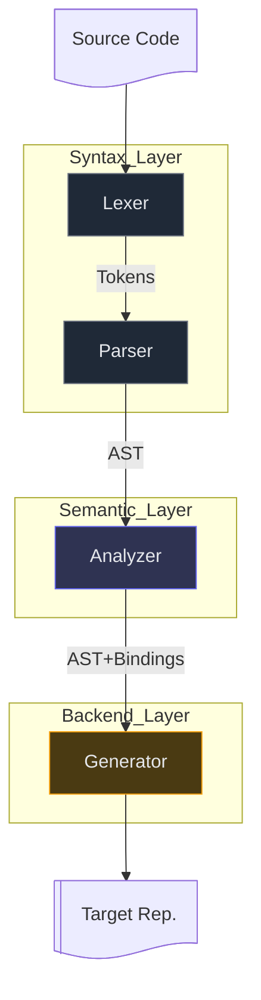

# Compiler Pipeline

This document describes the architecture of the FreshlyGround compiler.

The compiler is organized as a sequence of **stages**, each responsible for transforming one program 
representation into another.

From a conceptual perspective these stages belong to three broader **layers**:

- **Syntax layer** — lexing and parsing
- **Semantic layer** — analysis and binding
- **Backend layer** — target emission

The layers group stages by the level of interpretation they operate on: syntactic structure,
semantic meaning, or target (backend) representation. Within their respective level each 
stage performs a single transformation and produces a well-defined artifact consumed by the next stage.

## System Overview
At a high level, FreshlyGround follows a layered, single-direction pipeline. The diagram below shows the 
compilation pipeline and the artifacts produced between stages.

## Individual Stages

Each stage in the pipeline consumes a specific artifact and produces the artifact required by the next stage.
The guarantees established by one stage become the assumptions relied upon by the next.

::: info Lexing (Tokenization)

**Input:** Source Text

**Output:** Token Stream

**Responsibilities:**

* classify characters into typed tokens
* preserve positional metadata for diagnostics

**Guarantees:**

* tokens are well-formed (integers, identifiers, strings, operators)
* invalid lexemes produce compiler errors

:::

::: info Parsing (Syntactic Analysis)

**Input:** Token Stream

**Output:** Abstract Syntax Tree (AST)

**Responsibilities:**

* enforce grammar correctness (EBNF)
* encode precedence and associativity in tree shape

**Guarantees:**

* the AST is structurally valid and internally consistent
* all syntactic rules are satisfied
* invalid syntax produces compiler errors

:::

::: tip Analyzing (Semantic Analysis)

**Input:** AST

**Output:** AST + Bindings

**Responsibilities:**

* build lexical scope chains
* resolve identifiers into variables, functions, or types
* attach semantic meaning to AST nodes through Bindings

**Guarantees:**

* every identifier resolves to a valid binding
* every expression has a concrete static type
* all semantic rules are satisfied
* invalid semantics produce compiler errors

:::

::: warning Generating (Lowering / Emitting)

**Input:** AST + Bindings

**Output:** Target Representation

**Responsibilities:**

* deterministically lower analyzed programs into target representation
* remain purely mechanical (no semantic decisions)

**Guarantees:**

* backend output faithfully preserves language semantics

:::
