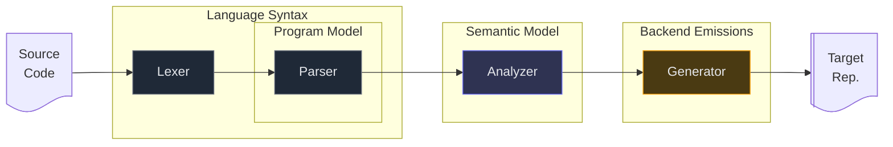

---
# https://vitepress.dev/reference/default-theme-home-page
layout: home

hero:
  name: "FreshlyGround"
  text: "Compiler & Language Reference"
  tagline: A programming language brewed from first principles
  actions:
    - theme: brand
      text: Read the Docs
      link: /01_pipeline
    - theme: alt
      text: Try the Live Compiler
      link: https://freshlyground.onrender.com

---

---

# About the Project

FreshlyGround is an educational programming language and compiler designed to explore modern compiler
architecture from first principles. The system separates compilation into distinct stages, each stage is documented independently
in this reference.

::: tip Recommended reading order:
1. **Compiler Pipeline** — High-level overview of the compilation architecture.
2. **Language Syntax** — Formal grammar and lexical rules that define the structure of valid programs.
3. **Program Model** — Specification of the Abstract Syntax Tree (AST) and the internal structures used to represent programs.
4. **Semantic Model** — Rules governing name resolution, scope construction, type checking, and the binding of identifiers to variables and functions, along with the determination of static types for expressions.
5. **Backend Emissions** — Deterministic lowering of analyzed programs into the WAT backend target.

:::

::: warning Core terminology used throughout the documentation...

- **Token Stream:** Ordered sequence of lexical units produced by the lexer.
- **AST (Abstract Syntax Tree):** Tree representation produced by the parser that mirrors grammar structure.
- **Environment:** Global catalog of known types, functions, and variables.
- **Bindings:** Semantic mappings that associate AST nodes with their resolved entities.
- **Scope:** Visibility chain used for resolving identifiers.
- **Lowering:** Deterministic emission from analyzed AST to backend representation.

:::

